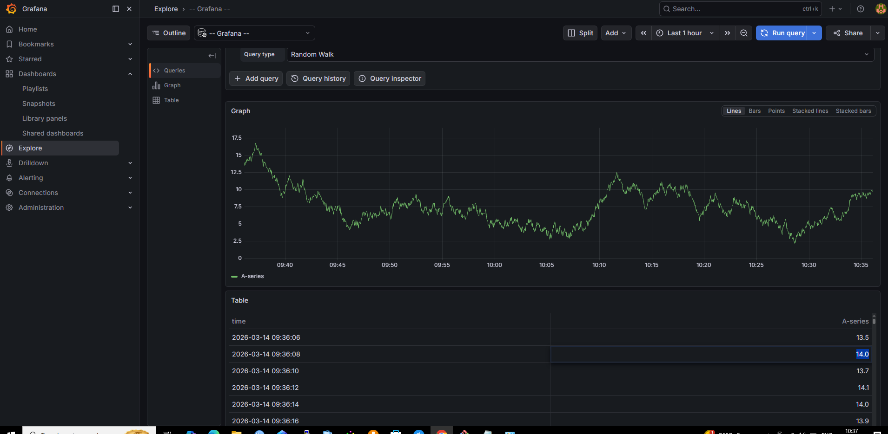
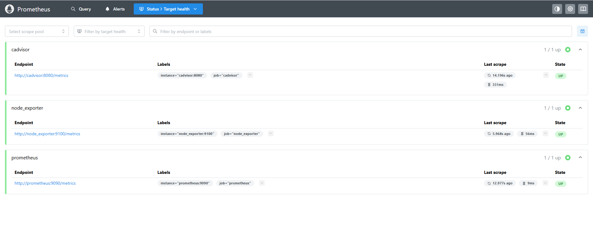
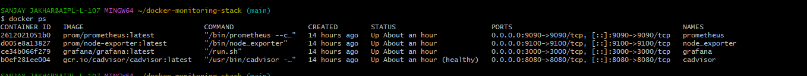

# Docker Microservices Monitoring Stack

This project demonstrates a production-style monitoring stack for Docker containers using Prometheus, Grafana, cAdvisor, and Node Exporter.

## Architecture

Docker Host
 ├── Node Exporter (Host Metrics)
 ├── cAdvisor (Container Metrics)
 └── Docker Microservices
        ↓
     Prometheus
        ↓
      Grafana

## Tech Stack

- Docker
- Prometheus
- Grafana
- cAdvisor
- Node Exporter
- PromQL

## Setup

Clone repository:

git clone https://github.com/sanjayjakhar33/docker-monitoring-stack.git

cd docker-monitoring-stack

Run monitoring stack:

docker compose up -d

## Access

Grafana  
http://localhost:3000

Prometheus  
http://localhost:9090

cAdvisor  
http://localhost:8080

## Grafana Login

username: admin  
password: admin

## Dashboard

Recommended Grafana dashboard:  
Docker / Container Monitoring (cAdvisor)  
Dashboard ID: 14282

## Features

- Container CPU monitoring
- Memory monitoring
- Network traffic metrics
- Host resource monitoring
- Prometheus time-series metrics
- Grafana visualization

## Monitoring Dashboards

### Grafana Dashboard

### Prometheus Targets

### Docker Containers

